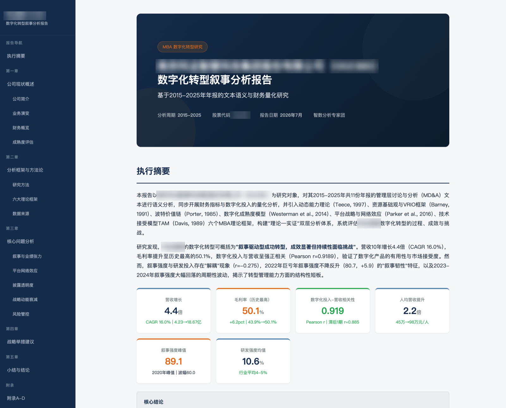
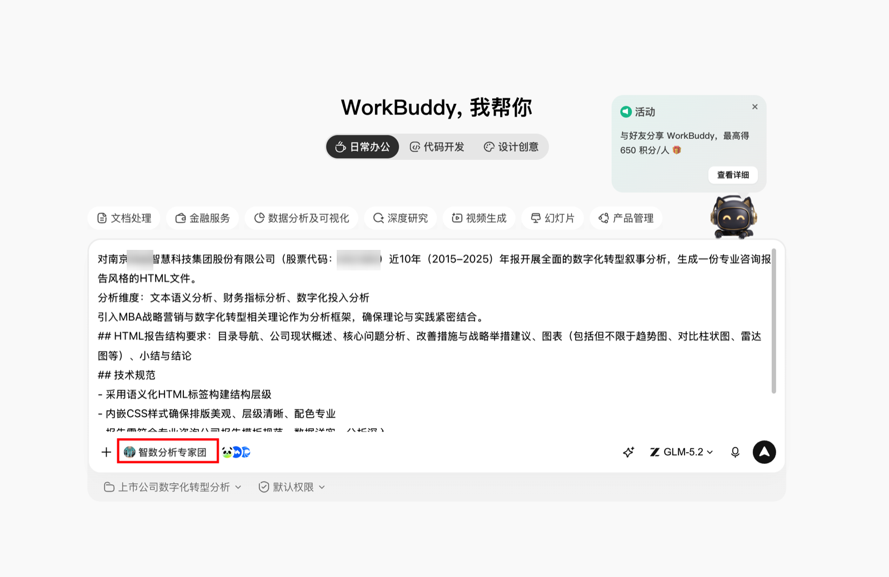
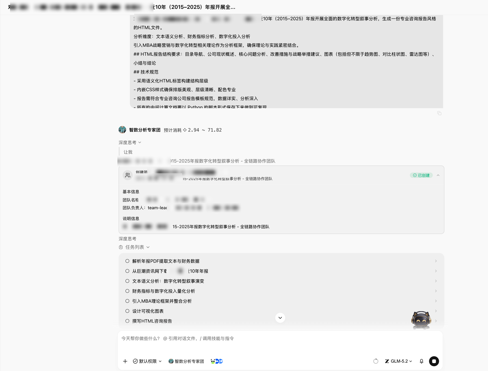
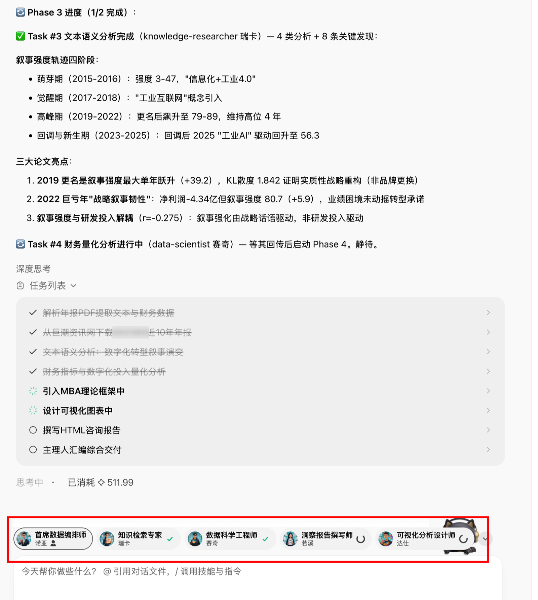
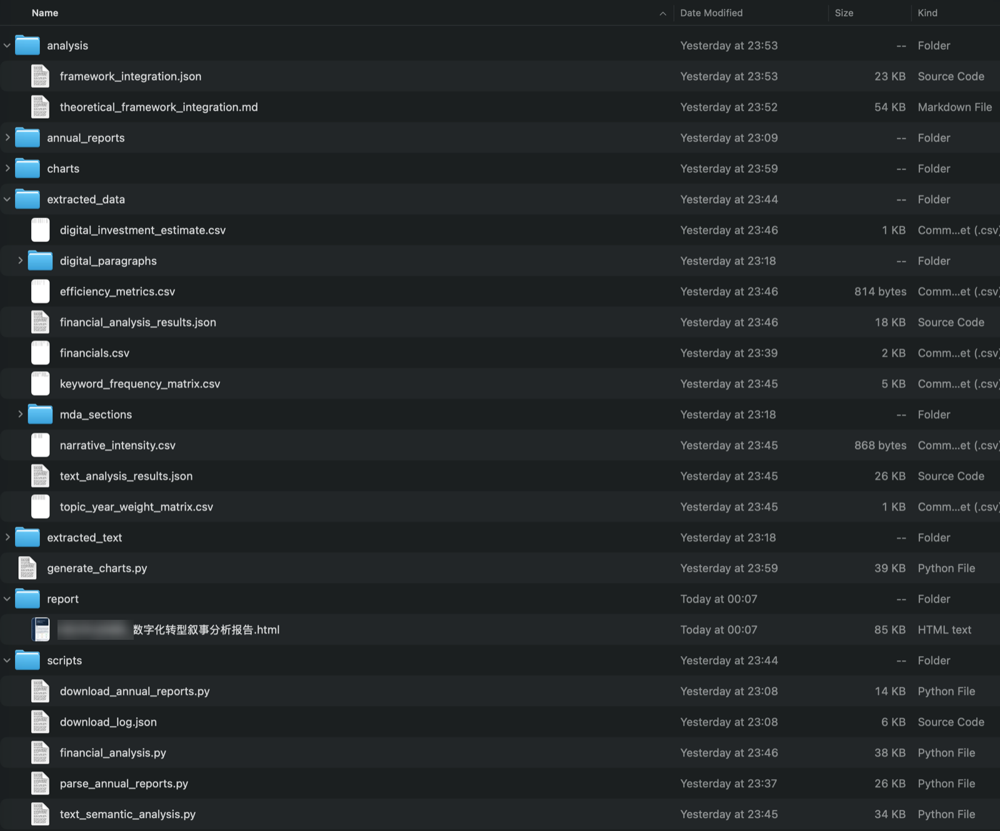
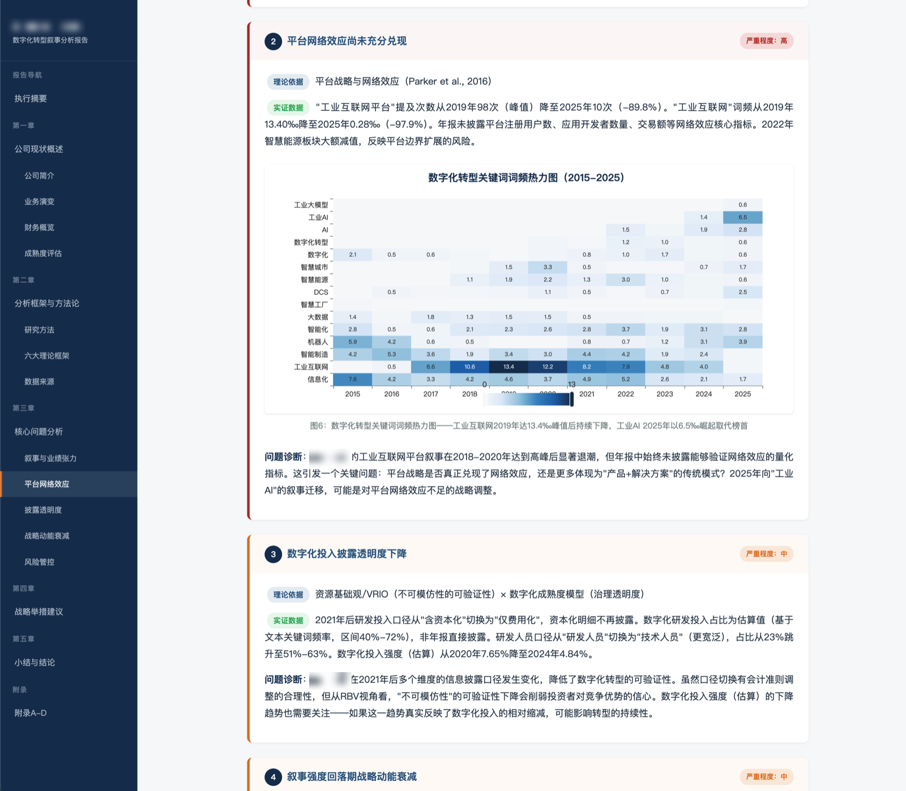
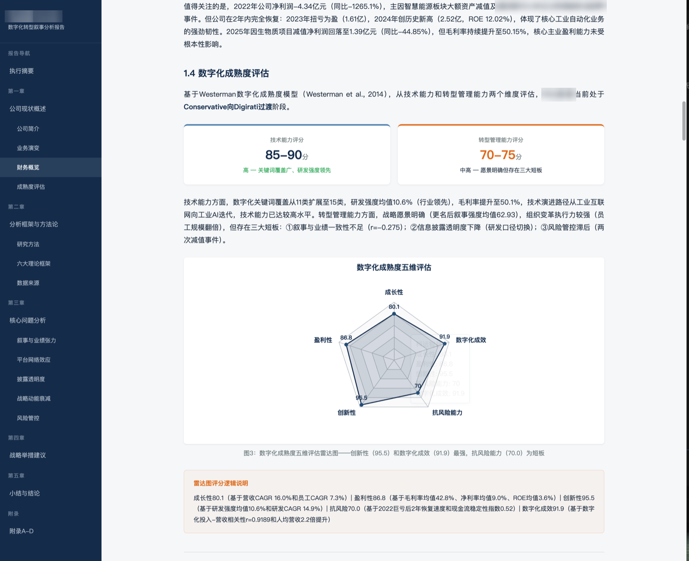
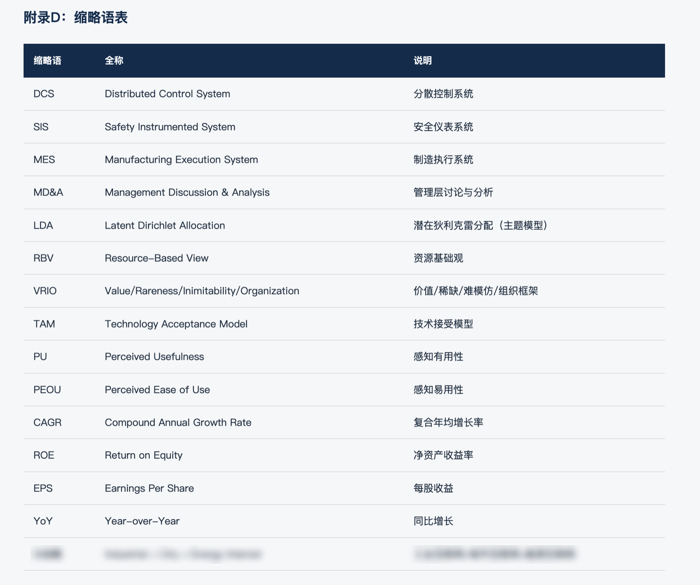
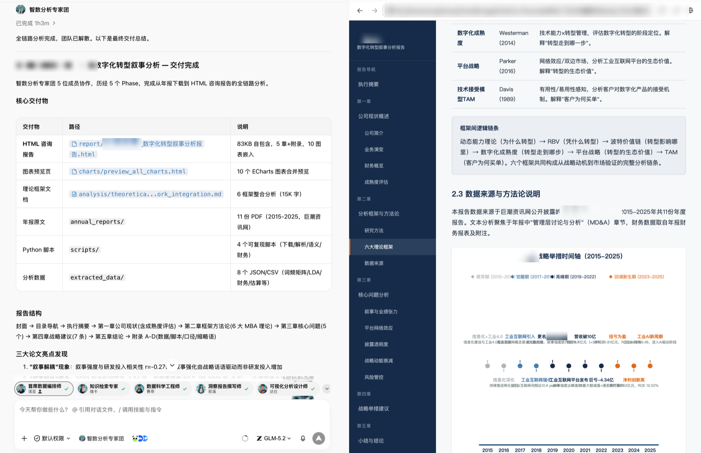

# 用 WorkBuddy 专家团吃透十年年报：一套可复用的上市公司深度研究方法



## 场景描述

商业分析人员（MBA 学员、咨询顾问、行业研究员、投资与战略岗）面对一家陌生上市公司时，核心问题不是「缺信息」，而是**如何在短时间内建立对这家公司完整、可信、可检验的认知**。最权威、最完整的公开素材是历年年度报告，但一年一份的年报动辄两三百页，十年就是数千页，人工通读并交叉核对叙事口径与财务数据通常需要数周，且很难做到逐年可比、口径一致。

这个案例的价值不在于「产出了一份数字化转型分析报告」这个交付物本身，而在于它完整演示了一套**通用的「上市公司深度研究」方法论**：以一手信源为底座、文本与数据双线交叉验证、理论框架作分析骨架、全流程可复现——并把这套方法一次性交给 WorkBuddy 的「智数分析专家团」（Agent Swarm 多智能体团队）执行：从巨潮资讯网下载十年年报原文，到 PDF 解析、文本语义分析、财务量化、理论框架整合、图表制作，再到最终 HTML 咨询报告，全链路自动完成，所有中间计算以 Python 脚本保存、可复现复算。

本案例选中的分析主题是「数字化转型叙事」，但它只是这套方法论的一个「镜头」。研究管线本身（年报获取 → 结构化解析 → 文本+财务双线量化 → 理论框架整合 → 咨询报告交付）与分析主题无关，可以直接迁移到上市公司运营分析、销售与营销分析、人力资源分析、财务质量分析、ESG 分析等各类工商管理研究场景，只需替换提示词模板中的占位符（见下文「提示词或任务指令」）。

## 想要完成的任务

输入：一家工业自动化领域的 A 股上市公司的名称与股票代码（本案例已对具体公司做匿名化处理），以及分析区间（2015–2025，共 11 个年度）。

目标和交付物：

1. 从巨潮资讯网自动下载分析区间内的全部年报原文 PDF（11 份）
2. 解析年报，聚焦「管理层讨论与分析」（MD&A）章节，做文本语义分析：关键词词频、主题模型（LDA）、叙事强度轨迹
3. 提取财务数据，做财务指标与数字化投入的量化分析（增长、盈利、研发强度、人均效能等）
4. 引入 MBA 战略与数字化转型理论作为分析框架，理论与实践结合
5. 生成一份专业咨询报告风格、可离线打开的 HTML 报告：目录导航、公司现状概述、核心问题分析、改善措施与战略举措建议、图表（趋势图、对比柱状图、雷达图等）、小结与结论
6. 所有中间计算以 Python 脚本保存，保证全流程可复现

这套任务定义背后，是一套可以迁移到任何一家公司的研究方法论，也是商业分析人员系统研究一家上市公司的标准思路：

- **以一手信源为底座**：不依赖二手研报和新闻拼凑印象，直接从官方披露渠道获取十年年报原文，确保分析起点是未经转述的一手材料。
- **文本 + 数据双线交叉验证**：管理层叙事（文本语义）说了什么，与财务数据实际呈现什么，两条线对照才能识别「叙事与现实的偏离」——本案例的「叙事解耦」发现正是由此而来。
- **理论框架作为分析骨架**：用成熟的工商管理理论组织发现、解释数据，而不是把指标堆砌在一起；理论是骨架，数据是证据。
- **全流程可复现**：中间计算以脚本保存，任何结论都可被复查、复算——这是「研究」区别于「一次性生成」的关键，也是结论敢拿去答辩、汇报、尽调的前提。
- **专家团分工与研究流程同构**：资料检索 → 数据工程 → 分析 → 可视化 → 成稿，智能体的角色分工与人的研究团队一一对应，方法论不需要为工具做任何妥协。

## 使用的 Skill

| Skill | 用途 | 来源或安装方式 |
| --- | --- | --- |
| 浏览器 | 访问巨潮资讯网，检索并下载指定公司分析区间内的年度报告 PDF | WorkBuddy 内置 |
| 本地文件读写 | 组织年报、中间数据、脚本与交付物的目录结构 | WorkBuddy 内置 |
| Python 代码执行 | 运行 PDF 解析、文本语义分析、财务分析、图表生成等可复现脚本 | WorkBuddy 内置 |

多智能体协同由 WorkBuddy 的「智数分析专家团」（Agent Swarm）完成：下达总指令后，专家团自动拆解任务、生成 to-do list，并由团队负责人按角色分派给知识检索、数据科学、报告撰写、可视化设计等成员并行执行。无需额外安装 Skill。

## 前置条件

- WorkBuddy 可正常使用，能读写本地文件、能联网（用于从巨潮资讯网下载年报）
- WorkBuddy 自带的 Python 环境（由 WorkBuddy 自动管理，无需手工安装依赖）
- 可使用「智数分析专家团」（Agent Swarm 多智能体团队）
- 不需要任何付费账号或 API Key（年报为公开披露文件）
- 分析对象为公开上市公司，分析区间内的年报在巨潮资讯网上均可获取

## 在 WorkBuddy 中的操作

1. **下达总指令**：在 WorkBuddy 首页输入任务指令，并在输入框左侧选中「智数分析专家团」。指令只需说清公司、区间、分析维度、理论框架、交付物和技术规范（泛化模板见下一节）。



2. **专家团拆解任务**：专家团接到指令后自动创建协作团队（团队名按「公司-分析主题」自动命名），并生成任务清单 to-do list：下载年报 → 解析 PDF 提取文本与财务数据 → 文本语义分析 → 财务指标与数字化投入量化分析 → 引入 MBA 理论框架并整合 → 设计可视化图表 → 撰写 HTML 咨询报告 → 汇编综合交付。



3. **分工并行执行**：团队负责人按阶段（Phase）调度 5 位成员——首席数据编排师、知识检索专家、数据科学工程师、洞察报告撰写师、可视化分析设计师。底部成员头像实时显示各自进度（✓ 已完成 / 转圈中为执行中），每完成一项任务，负责人会汇报关键发现，例如「叙事强度轨迹四阶段」这类中间结论。



4. **过程产物落盘**：执行过程中，年报原文、解析后的文本与结构化数据、可复现脚本、中间分析结果分别写入 `annual_reports/`、`extracted_text/`、`extracted_data/`、`scripts/` 等目录，全程可追溯。



5. **交付汇总**：全部任务完成后，专家团给出交付总结（本案例耗时约 1 小时），列出每项交付物的路径和说明，人只需打开最终 HTML 报告审阅。

## 提示词或任务指令

以下为本案例提示词的**泛化模板版**。将 `{占位符}` 替换为具体内容，即可复用到任何一家上市公司、任何一种工商管理分析主题：

```text
对 {公司名称}（股票代码：{股票代码}）在 {分析区间，如 2015–2025} 的 {数据来源，如历年年报}
开展全面的 {分析主题，如数字化转型叙事分析}，生成一份专业咨询报告风格的 {交付物格式，如 HTML 文件}。

## 分析维度
{分析维度，如：文本语义分析、财务指标分析、数字化投入分析；
 换主题可替换为：运营效率、销售结构、人力资源效能、财务质量、ESG 表现等}

## 理论框架
引入 {理论框架，如 MBA 战略营销与数字化转型相关理论} 作为分析框架，
确保理论与实践紧密结合。

## 交付物结构要求
{交付物结构，如：目录导航、公司现状概述、核心问题分析、改善措施与战略举措建议、
 图表（趋势图、对比柱状图、雷达图等）、小结与结论}

## 技术规范
- 采用语义化 HTML 标签构建结构层级，内嵌 CSS 样式，排版美观、层级清晰、配色专业
- 报告需符合专业咨询公司报告模板规范，数据详实、分析深入
- 所有的中间计算以 Python 脚本形式保存下来，做到可复现
- 原始数据从 {数据来源渠道，如巨潮资讯网} 获取原文
```

各占位符填写说明（括号内为本案例的填写示例）：

- `{公司名称}` / `{股票代码}`：分析对象（示意写法：某智能制造企业 / 6 位股票代码；本案例填写的是一家工业自动化领域的 A 股上市公司）。换公司时只需替换这两项。
- `{分析区间}`：建议覆盖 5–10 个完整年度，保证趋势可比（2015–2025，共 11 份年报）。
- `{数据来源}`：原始素材类型与获取渠道（巨潮资讯网公开披露的年度报告）。也可换成招股说明书、ESG 报告、业绩说明会纪要等。
- `{分析维度}`：决定专家团拆解出的分析任务（文本语义分析、财务指标分析、数字化投入分析）。
- `{理论框架}`：希望引入的理论体系（MBA 战略营销与数字化转型理论——实际执行中专家团落到了动态能力、资源基础观/VRIO、波特价值链、数字化成熟度、平台战略与网络效应、技术接受模型 TAM 六大框架）。
- `{交付物结构}` 与 `{技术规范}`：把「报告长什么样」写死，避免交付形态靠模型猜；「中间计算以 Python 脚本保存」这一条务必保留，它是可复查、可复算的关键。

这套模板适用于工商管理领域的各类上市公司分析：战略与数字化转型、运营效率、销售与营销、人力资源、财务质量、ESG 等，换主题时只改 `{分析维度}` 和 `{理论框架}` 两处即可。

## 在 WorkBuddy 中的效果

**最终交付物**：一份 85 KB 自包含的 HTML 咨询报告（双击离线可打开），左侧为目录导航，正文含执行摘要、五章正文与附录 A–D，内嵌 10 张图表。报告首页即给出执行摘要与六张核心指标卡：营收十年增长 4.4 倍（CAGR 16.0%）、毛利率升至历史最高的 50.1%、数字化投入与营收强相关（Pearson r=0.919）、人均营收提升 2.2 倍、叙事强度峰值 89.1、研发强度均值 10.6%。


**核心问题分析**：第三章以「问题卡片」形式呈现五大核心问题，每张卡片标注严重程度、理论依据与实证数据。例如「平台网络效应尚未充分兑现」：以平台战略与网络效应理论（Parker et al., 2016）为依据，用「数字化转型关键词词频热力图（2015–2025）」佐证——「工业互联网」词频从 2019 年峰值持续回落，「工业 AI」于 2025 年崛起取代榜首。



**理论框架与数据结合**：基于 Westerman 数字化成熟度模型，从技术能力与转型管理能力两个维度给出评分（85–90 分 / 70–75 分），并配「数字化成熟度五维评估」雷达图（成长性、数字化成效、抗风险能力、创新性、盈利性），图下附评分逻辑说明，每个分值都能对应到具体财务或文本指标。



**附录的专业度**：报告末尾附缩略语表（DCS、MD&A、LDA、RBV、VRIO、TAM、CAGR、ROE 等逐一给出全称与释义），连同数据来源、脚本说明、口径说明共四个附录，符合咨询交付物规范。



**WorkBuddy 中的交付总结**：专家团完成后给出交付清单——HTML 咨询报告、10 个 ECharts 图表合并预览页、六大理论框架整合分析文档（约 1.5 万字）、11 份年报原文、4 个可复现 Python 脚本、8 个中间分析数据文件（JSON/CSV），并提炼出三大论文级亮点发现，如「叙事解耦」现象（叙事强度与研发投入相关性 r=-0.275）、某亏损年度的「战略叙事韧性」（业绩大幅亏损当年叙事强度不降反升）。



> 📎 报告原文（已匿名化，可在线打开）：[company-deep-research-report.html](/cases/submissions/annual-report-digital-transformation/company-deep-research-report.html)

## 验收标准

- **年报齐全**：`annual_reports/` 目录下 11 份 PDF 齐全，覆盖 2015–2025 每个年度，均来自巨潮资讯网，与该公司实际披露一一对应（注意剔除年报摘要、英文版、更正公告等干扰文件）
- **脚本可复现**：`scripts/` 下 4 个脚本（下载、解析、文本语义分析、财务分析）可独立重跑，重跑结果与 `extracted_data/` 下 8 个中间数据文件（词频矩阵、LDA 主题权重、叙事强度、财务指标等 JSON/CSV）一致
- **报告可打开**：最终 HTML 报告自包含（CSS 内嵌、图表已嵌入），断网双击可打开；左侧目录导航可跳转；公司现状、分析框架与方法论、核心问题分析、战略举措建议、小结与结论五章及附录 A–D 齐全
- **数字可核对**：报告中的关键数字（营收 4.23 亿→18.67 亿、CAGR 16.0%、毛利率 50.1%、Pearson r=0.9189 等）能与年报原文和 `extracted_data/` 中间结果对账，建议人工抽查 3–5 个
- **理论落地**：每个理论框架都有对应的实证数据支撑，且理论整合逻辑在 `analysis/theoretical_framework_integration.md` 中有完整文档说明，不是报告里的一句空话

## 遇到的问题

- **年报 PDF 解析难度大**：年报版式复杂（多栏排版、扫描件、复杂表格），直接全文抽取容易出现乱码、断行和表格错位。解决方式是按章节切分、聚焦 MD&A 等文本密集型章节做语义分析，财务数据单独走结构化提取，解析脚本中保留容错与日志。
- **巨潮资讯网下载需筛选**：同一公司同一年度可能同时存在年报全文、摘要、英文版、取消/更正版等多份公告，下载脚本需要按公告类别过滤并去重；同时需控制访问频率，避免触发网站限制。
- **披露口径中途变化**：2021 年后该公司研发投入口径从「含资本化」切换为「仅费用化」，资本化明细不再披露，导致部分数字化投入指标只能给出估算区间。报告中对这类口径切换做了显式标注，而不是把口径不同的数字直接连成趋势线——这一点在换公司复用时几乎必然遇到。
- **语义分析的计算量**：11 年 MD&A 全文做分词、词频统计和 LDA 主题建模耗时较长，专家团将其拆为独立阶段执行，中间结果落盘（词频矩阵、主题权重矩阵 CSV），失败可断点重跑。

## 安全与限制

- 年报属于**公开披露信息**，数据来源合法合规，本案例不含任何个人隐私或企业敏感数据，可公开分享。
- 下载年报需联网访问巨潮资讯网，请控制抓取频率、仅下载分析所需文件，遵守目标网站的使用条款，不要批量爬取无关公告。
- 报告由 AI 生成，**不构成投资建议**；叙事强度、数字化投入估算等属于文本挖掘推导指标，并非公司官方披露口径，引用前需与年报原文核对。
- PDF 自动解析可能漏抽个别表格或数字，关键财务指标正式使用前务必人工抽查复核。
- 整套流程只读写本地工作目录；执行会在目录下生成较多中间产物（脚本、CSV、日志），归档时注意区分交付物与过程文件。

## 可以怎样复用

这套案例最值得带走的是研究范式，而不是某一个分析主题。商业分析人员拿到任何一家上市公司——尽职调查、竞品分析、行业研究、求职前了解目标公司、课程案例作业——凡是需要「快速建立对一家公司完整、可信、可检验认知」的场景，都可以直接套用同一条研究管线：一手信源 → 结构化解析 → 文本+数据双线交叉验证 → 理论框架组织发现 → 可复现交付。

- **换分析主题只是换「镜头」**：运营分析（产能、供应链、成本结构）、销售与营销分析（渠道、客户结构、区域分布）、人力资源分析（员工结构、人均效能、薪酬与激励）、财务质量分析（现金流、偿债、减值风险）、ESG 分析——只需改写 `{分析维度}` 和 `{理论框架}` 两处占位符，研究管线原样不动。
- **换一家公司**：把泛化模板中的 `{公司名称}`、`{股票代码}`、`{分析区间}` 换掉即可，下载脚本和分析流程原样复用；先确认目标公司在巨潮资讯网上年报齐全。
- **换一类原始素材**：同模板也适用于招股说明书、ESG/可持续发展报告、业绩说明会纪要、券商研报合集，把 `{数据来源}` 换成对应渠道即可。
- **保留「可复现」这条硬性要求**：「所有中间计算以 Python 脚本保存」是全案例最有复用价值的一句提示词——它让任何结论都能被复查、被复算，是把 AI 分析从「看起来专业」变成「经得起检验」的关键，也是这套方法能被称为「研究」的原因。
- **多智能体团队适合长链路任务**：凡是要「下载 → 清洗 → 分析 → 可视化 → 成稿」一气呵成的任务，交给专家团拆解执行比自己逐轮下指令更稳；其分工（检索、数据工程、分析、可视化、成稿）与人的研究团队同构，中间汇报也便于在关键节点人工确认口径。
